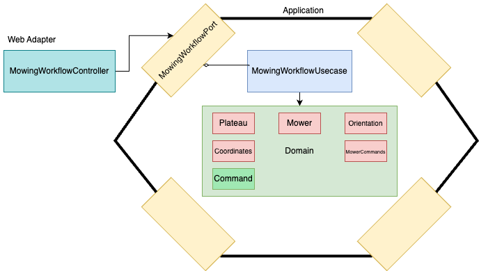

# Seat Robotic Mower Control

Centralized application for controlling new mowers at the SEAT Martorell Factory.
- [Architecture](#architecture)
    - [ARD 1. Design assumptions](<doc/ADR-1-Design-assumptions.md>)
    - [ARD 2. CLI vs API rest](<doc/ADR-2-CLI-vs-REST-API.md>)
    - [ARD 3. Design patterns](<doc/ADR-3-Design-patterns.md>)
- [Run the service locally](#run-the-service-locally)
    - [Pre-requisites](#pre-requisites)
    - [Run the mower control service](#run-the-mower-control-service)
    - [Test the workflow API](#test-the-workflow-api)
- [Improvements](#improvements)

## Architecture


- [ARD 1. Design assumptions](<doc/ADR-1-Design-assumptions.md>)
- [ARD 2. CLI vs API rest](<doc/ADR-2-CLI-vs-REST-API.md>)
- [ARD 3. Design patterns](<doc/ADR-3-Design-patterns.md>)

## Run the service locally
### Pre-requisites
- [Make](https://www.gnu.org/software/make/)
- [Maven](https://maven.apache.org/)
- [Java 17](https://www.oracle.com/java/technologies/downloads/#java17)
- [Curl](https://curl.se/download.html)

The `make help` utility is available to the developer and provides a list of useful commands.

### Run the mower control service
First, build the seat-robotic-mower-control-0.0.1-SNAPSHOT.jar:

    ```bash
    make build
    ```

You can also execute unit and e2e tests by:

    ```bash
    make test
    ```

Then, run the service (it builds up the service anyways again anyways):

    ```bash
    make run
    ```
### Test the workflow API
When the service is running you should be able to access the workflow API http://localhost:8080/api/workflow. 

Since it is a public API you should be able to test it using curl:
```bash
 curl -X POST -F file=@"./src/test/resources/test-assessment-workflow.txt" http://localhost:8080/api/workflow
```

You can also use the `make` utility to automatically execute curl operation given a desired input file path:
```bash
make create-test-workflow f=./src/test/resources/test-assessment-workflow.txt
```

Finally, and maybe the easiest, you can always use the **Swagger API** at http://localhost:8080/swagger-ui/index.html#/mowing-workflow-controller/createWorkflowFromFile

At **src/test/resources** you can find a useful collection of input file examples!

## Future improvements
