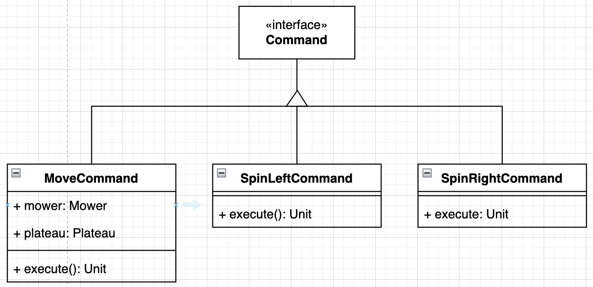
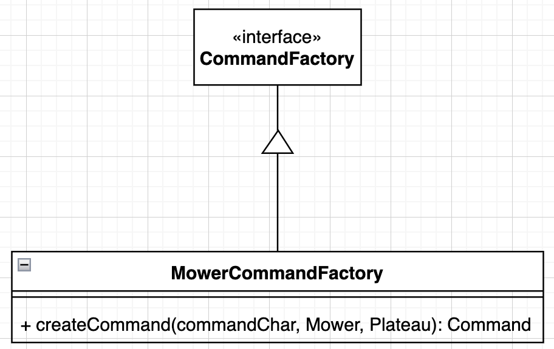

# ADR 3. Design Patterns

## OBJECTIVE
Document and elucidate the design process behind our model, emphasizing the adoption of specific design patterns to enhance modularity and maintainability.

## CONTEXT
In the initial stages of the project, it became evident that a composite data model was most suitable. This model entails a main entity, Plateau, which is composed of multiple Mowers.

## DECISIONS

### Rich Domain Model with Delegator Pattern
Initially, a **Rich Domain Model** was chosen, utilizing the delegator design pattern. This design involved:

- **Delegating Responsibilities**: The Plateau entity was designed to act as the central coordinator, delegating specific tasks to the Mowers. This approach aimed to encapsulate logic within the domain entities, allowing Plateau to manage Mowers interactions and movement logic.
- **Simplifying Interactions**: By delegating responsibilities directly to the domain entities, the model initially aimed to reduce the complexity of interactions within the system, promoting a more intuitive and maintainable architecture.

### Transition to Anemic Domain Model
However, it quickly became apparent that a Rich Domain Model might overcomplicate the interactions between the entities due to excessive logic embedded within the domain objects themselves. To address this, the decision was made to shift towards an **Anemic Domain Model** through a centralizing logic in a `@Service`. The service, now designated as the usecase, was tasked with broader responsibilities, moving away from a delegator-centric approach. This includes:
- **Parsing and Validating Input**: This operation is offloaded to a separate `@Component` to adhere to the Single Responsibility Principle, ensuring that our service remains focused on core functionalities.
- **Mower Movement Coordination**: The service orchestrates the movement of mowers across the field. It ensures that the mowers do not collide and remain within the predefined boundaries of the grid.

### Command Design Pattern
As the project progressed, the service logic began to expand significantly, complicating its maintenance and scalability. To address this, the `command design pattern` was implemented to abstract the specifics of mower operations into discrete commands:

- **SpinRightCommand(R) and SpinLeftCommand(L)**: These commands adjust the mower's orientation. They are straightforward but crucial for correct mower navigation.
- **MoveCommand(M)**: This command not only advances the mower but also pre-validates the movement against grid constraints and potential collisions.

This design pattern significantly decluttered the service, separating the operational logic from the command logic and enhancing the code's readability and scalability.

### Factory Method Design Pattern
I must admit at this point something looked a little bit odd to me... We were missing the `factory method design pattern` of course! This pattern centralizes command creation in a Factory class, which:

- **Decouples command creation from the service**, allowing for easier modifications and extensions to command logic.
- **Simplifies the service** by delegating the responsibility of command instantiation based on the input command identifier (L, M, R) to the Factory. 

This ensures that the service remains agnostic of the specifics of command instantiation and focuses on higher-level orchestration.

### Potential Inclusion of Abstract Factory
Considering future enhancements and different mower versions, the potential inclusion of the abstract factory design pattern can be evaluated. This pattern would allow us to manage multiple factory method classes, each tailored to different versions of mowers or perhaps different operational environments.

## CONCLUSION
The strategic implementation of design patterns has not only simplified the hexagonal architecture but also prepared the system for future enhancements. The clear segregation of responsibilities and the abstraction of operational logic into distinct patterns foster an adaptable and robust architecture, ready to accommodate evolving requirements and different operational contexts.

It's important to ensure that the service layer does not become a monolith, especially as features expand. We should consider discussing strategies to maintain its manageability, such as breaking it into smaller, more focused services or incorporating domain-driven design subdomains if complexity grows.